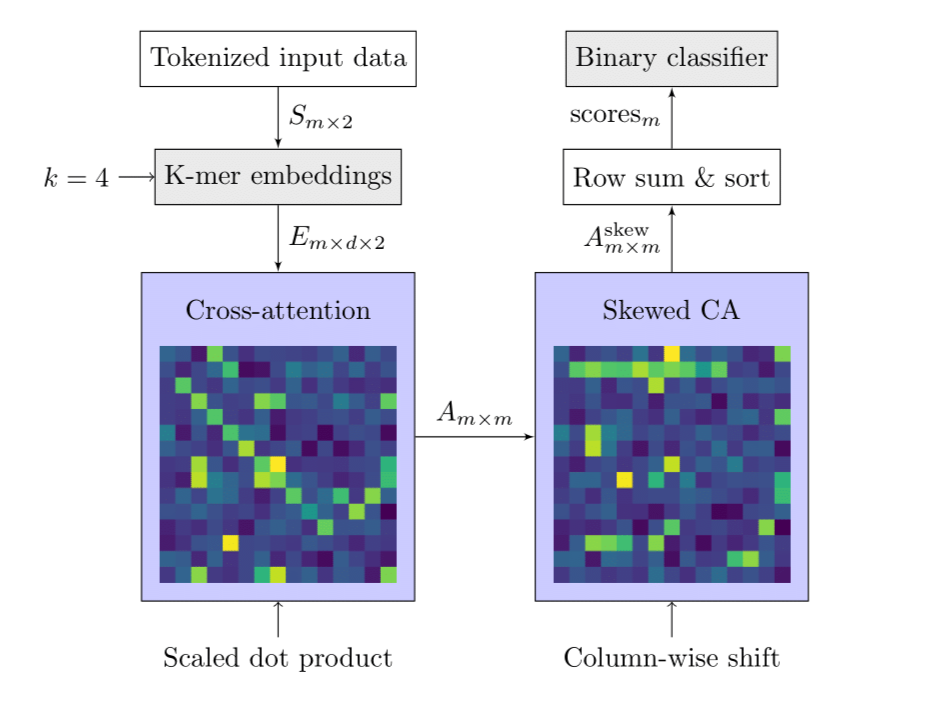

# Conserved-Blocks
A machine learning pipline for unsupervised identification of shared segments (conserved regions) of DNA across a microbial population.

## Skewed Cross-Attention
Our current implementation trains a novel Skewed Cross-Attention (SCA) model to identify pairs of sequences that share a conserved region. We then use this model to cluster a dataset via a SCRAPT-like iterative clustering algorithm (see next section).

Our model architecture is depicted below and is defined in `tfv2transformer/skew_attn.py`. SCA is lightweight and can be used on sequences of length 4,096 with a batch size of 32 on a Nvidia RTX A5000, despite the $O(n^2)$ space complexity imposed by the computation of a scaled dot product attention matrix.

Training is defined in `train-skew.py`. We only use synthetic data for this step, which we generate during training. The bounds for an accepted conserved region can be set at training time via command line arguments.

## Iterative Clustering
Our clustering algorithm is adapted from [SCRAPT](https://academic.oup.com/nar/article/51/8/e46/7076468) and is intended to scale well to large datasets. On each iteration, we perform dense clustering on all $n \choose 2$ pairs in a mini-batch, select cluster representatives via multiplicity, then search the entire dataset for sequences that share a conserved region with each cluster representative. Each iteration has $O(b^2+nc)$ time complexity, where $b$ is the mini-batch size, $n$ is the number of sequences in the dataset, and $c$ is the number of new clusters we have identified this interation.

This algorithm is defined in `cluster-binary.py`. 

## Evaluation

### BLAST Support
First, run `blastn -outfmt 0 -subject /path/to/data.fasta -query /path/to/data.fasta > blast-out.txt` for your dataset. This may not be feasible for very large datasets.

Then run `utils/blast-reduce.py`, setting the `blastfile` variable to your BLAST output file's location.

Finally, run `eval-blast.py`. This will determine whether each pairwise alignment implied by your output clusters is present in the BLAST alignment and report the BLAST support for each cluster.

### Self-Evaluation
Run `eval-self.py`. This will use SCA to evaluate each pairwise alignment implied by your output clusters. This can be useful for dismbiguating clusters in cases where a cluster representative contains multiple conserved regions.

## Repositories Used

### Transformer Implementations
[Big Bird](https://github.com/google-research/bigbird) ([paper](https://proceedings.neurips.cc/paper/2020/hash/c8512d142a2d849725f31a9a7a361ab9-Abstract.html)) (currently unused)

[Keras/TFv2 Transformer](https://github.com/lsdefine/attention-is-all-you-need-keras)

### Pretrained Embedding Model
[dna2vec](https://github.com/pnpnpn/dna2vec) ([paper](https://arxiv.org/abs/1701.06279))

Currently only used for the list of all 4-mers stored in `utils/4mers.txt`.
